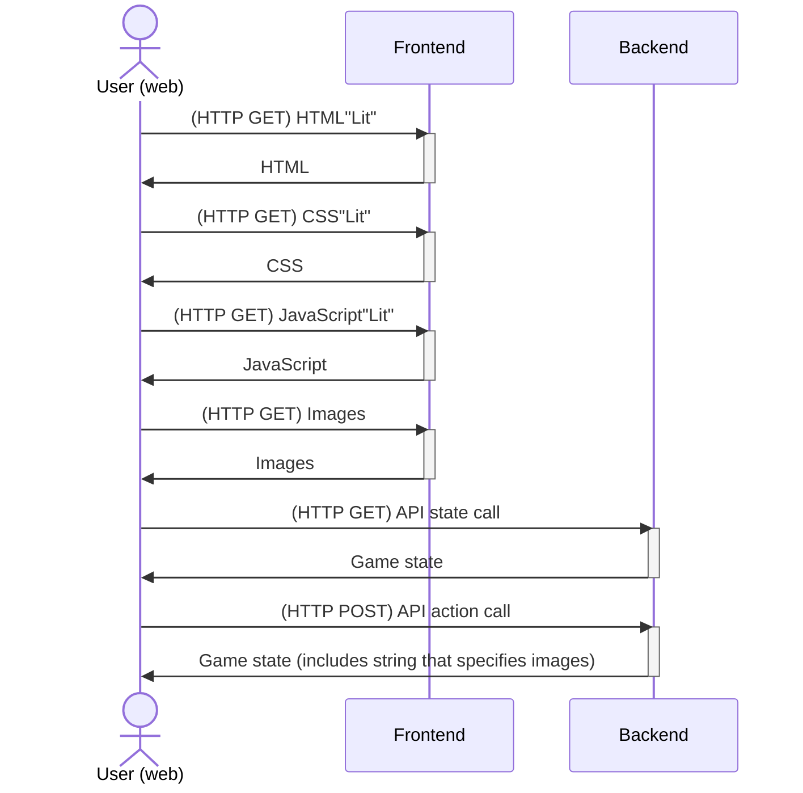

```mermaid
sequenceDiagram
  actor User (web)
  participant Frontend
  participant Backend

  User (web)->>Frontend: (HTTP GET) HTML"Lit"
  activate Frontend
  Frontend->>User (web): HTML
  deactivate Frontend
  User (web)->>Frontend: (HTTP GET) CSS"Lit"
  activate Frontend
  Frontend->>User (web): CSS
  deactivate Frontend
  User (web)->>Frontend: (HTTP GET) JavaScript"Lit"
  activate Frontend
  Frontend->>User (web): JavaScript
  deactivate Frontend
  User (web)->>Frontend: (HTTP GET) Images
  activate Frontend
  Frontend->>User (web): Images
  deactivate Frontend


  User (web)->>Backend: (HTTP GET) API state call
  activate Backend

  Backend->>User (web): Game state
  deactivate Backend

  User (web)->>Backend: (HTTP POST) API action call
  activate Backend

  Backend->>User (web): Game state (includes string that specifies images)
  deactivate Backend


```
