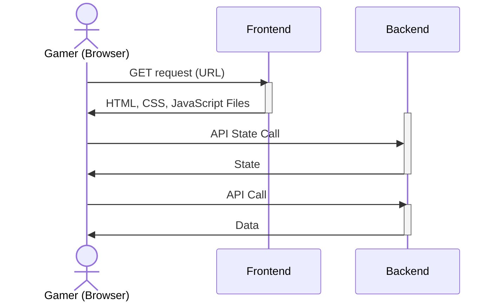

```mermaid
sequenceDiagram
actor Gamer (Browser)
participant Frontend
participant Backend
Gamer (Browser)->>Frontend: GET request (URL)
activate Frontend
Frontend->>Gamer (Browser): HTML, CSS, JavaScript Files
deactivate Frontend
activate Backend
Gamer (Browser)->>Backend: API State Call
Backend->> Gamer (Browser): State
deactivate Backend
Gamer (Browser)->>Backend: API Call
activate Backend
Backend->>Gamer (Browser): Data
deactivate Backend
activate Frontend
```
