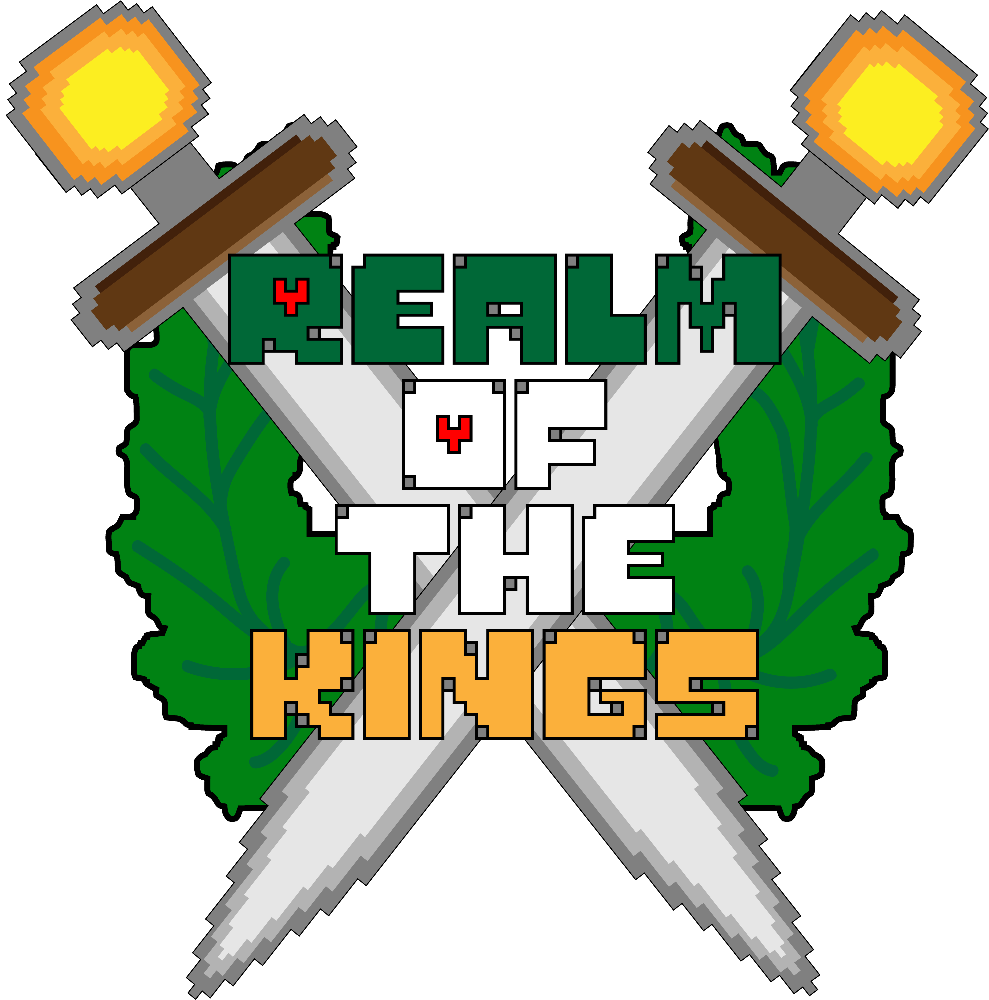
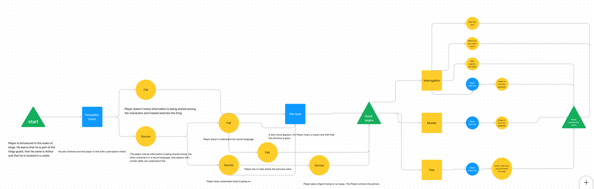
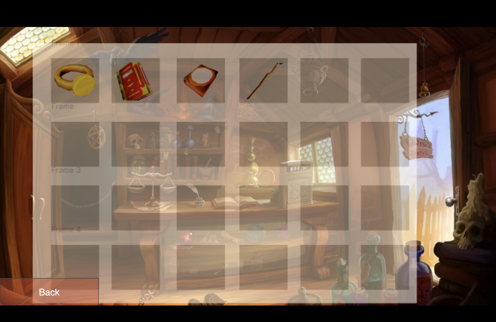

# Realm of the Kings 

## Characters
Main characters

Arthur, (male player character option) member of the kingsguard
Alexandra, (female player character option) member of the kingsguard
- players can choose if they want to play as Arthur or Alexandra, based on their choice the other character will become a following npc. 

Eleonora, princess of the realm (to be queen) 

## The story 
Arthur and the rest of the kingsguard are present at the crowning of the new queen during which she gets kidnapped. This sends the player and one other member of the kingsguard on a quest to save the queen an reclaim their honour. Two members of the kingsguard, Henry and Charles stay behind to protect the king. 

Running after the kidnappers, the main characters find out their horses have been stolen, and therefore they cannot chase the kidnappers quickly. However during the kidnappers' hurry to escape, one of them dropped a ring with the seal of the Low Lands, which after some investigation gives our characters a lead to follow.

### The map

### Wolburg
In the city Wolburg you make your way to the Lowlands, you can visit some shops or maybe go to the tavern to regenerate your health. The shops you can visit are not only in this city but across all towns in the world.

On your way to the next village you stumble upon a bear with feathers, also known as an Owlbear. You fight him to make your way further to the next village.

### Kara's Vale
After traveling south towards the lowlands the main characters first come across a village named Kara's Vale. While in the town the characters can ask around if anybody has seen the group of kidnappers. After some investigation the main characters find out that some people in the village did see a group of people riding horses around the village. They also discover nobody has ever been to the Low Lands and that they have only heard of the place.

### Volo's Village (Nederlands)
je loopt richting de directie van de lowlands en ziet 2 paden:
Het eerste pad wijst naar het dorpje Volo's village.
Het tweede pad wijst naar de Lowlands

Je bent nu in het dorpje en je ziet weer een taverne, blacksmith, en een winkeltje!
Er zijn mensen om mee te interacteren en gebouwen te bezoeken. (Je kan gebaseerd op clues weten bij wie je terecht komt. Je karakter zal de speler reminden indien dit het geval is). De speler zal mensen moeten spreken om een stuk van de puzzel voor Lowlands te bemachtigen. De speler zal 2 taken moeten oplossen in het dorpje om zo vervolgens 1 van de 2 stukken van  de puzzel te bemachtigen die hij zal krijgen van de dorpelingen. Je kan ook tijdens het volbrengen van de taken clues vinden om de Lowlands makkelijker te maken.

De 2 taken zijn nog onbekend maar 1 van ze wordt een raadsel en de andere een battle!

Na het bemachtigen van de sleutel kan je naar de lowlands.

### Volo's Village

### LowLands

### Back to Wolburg
